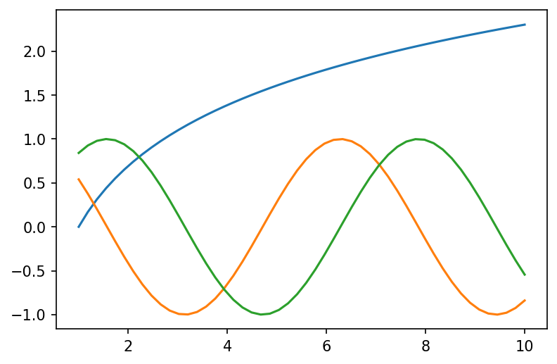

The example-based nature of [Matplotlib documentation](https://matplotlib.org/) is GREAT.

Matplotlib is the standard when it comes to making plots in Python. It is versatile and allows for lots of functionality and different ways to produce many plots.
We will be focusing on using matplotlib for High Energy Physics.

# A simple example
A with any python code it is always a good practice to import the necessary libraries as a first step.

```python
import matplotlib.pyplot as plt
```

Matplotlib graphs your data on Figures (i.e., windows, Jupyter widgets, etc.), each of which can contain one or more Axes (i.e., an area where points can be specified in terms of x-y coordinates, or theta-r in a polar plot, or x-y-z in a 3D plot, etc.). The simplest way of creating a figure with an axes is using pyplot.subplots. We can then use Axes.plot to draw some data on the axes:

```python
fig, ax = plt.subplots()  # Create a figure containing a single axes.
ax.plot([1, 2, 3, 4], [1, 4, 2, 3])  # Plot some data on the axes.
```
this code produces the following figure


> ## Notice
> If you look at the plot and the order of the list of numbers you can clearly see that the order of the arguments is of the form
>
> ~~~
> plt.plot(xpoints,ypoints)
> ~~~
> {: .language-python}
>
>But what is useful is that if we wanted to do more than one plot in the same figure we could do this in two main ways.
> ~~~
> plt.plot(xpoints,ypoints , xpoints_2,ypoints_2, xpoints_3,ypoints_3)
> ~~~
> {: .language-python}
Or the more traditional way
> ```python
> plt.plot(xpoints,ypoints)
> plt.plot(xpoints_2,ypoints_2)
> plt.plot(xpoints_3,ypoints_3)
> ```
> Both methods allow you to produce a plot like the following *(we will later see how to produce them in more detail)*
> > ## See example plot
> >
> > 
> {: .solution}
{: .callout}


# What goes into a plot?

Now, let's have a deeper look at the components of a Matplotlib figure.


## How to work with some of these elements?
> ## Note
> We will be making the plot shown in the **Notice** above as an example and develop on top of it for each element we will be showing.
This will be done gradually such to only need to add the lines shown in the code.
{: .callout}


For the following example you will need these lines as a starting point.

```python
import matplotlib.pyplot as plt
import numpy as np

x1 = np.linspace(1,10)
y1,y2,y3 = np.log(x1),np.cos(x1),np.sin(x1)

plt.plot(x1,y1,x1,y2,x1,y3);
plt.show()

```
These will produce the same plot as in the **Notice** above


### Axes Labels

In order to produce axes labels in matplotlib one uses the self descriptive command `xlabel` or `ylabel`

### Legend


### The Figure (resize and set the resolution)

### Title

### Grid


### Ticks


### Now for some styling (Lines or dots?)



