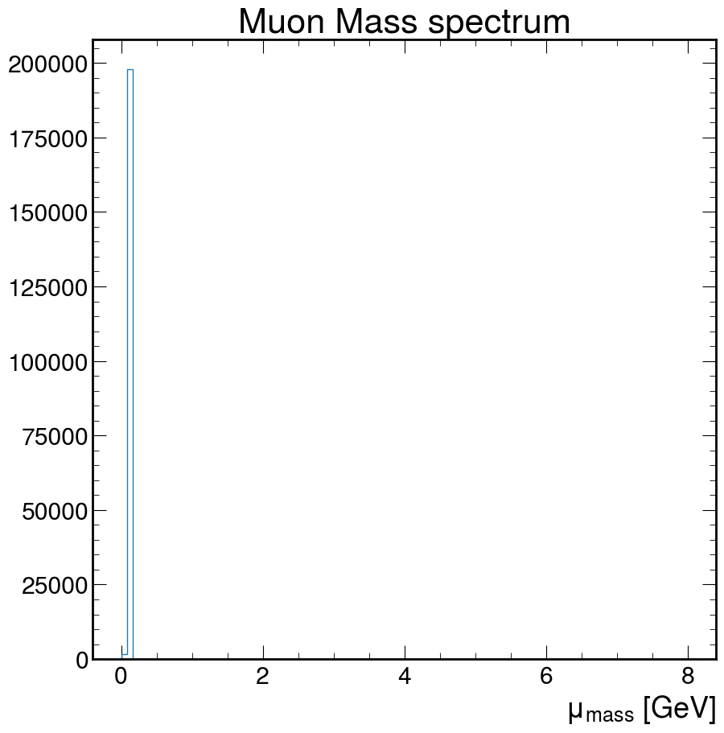
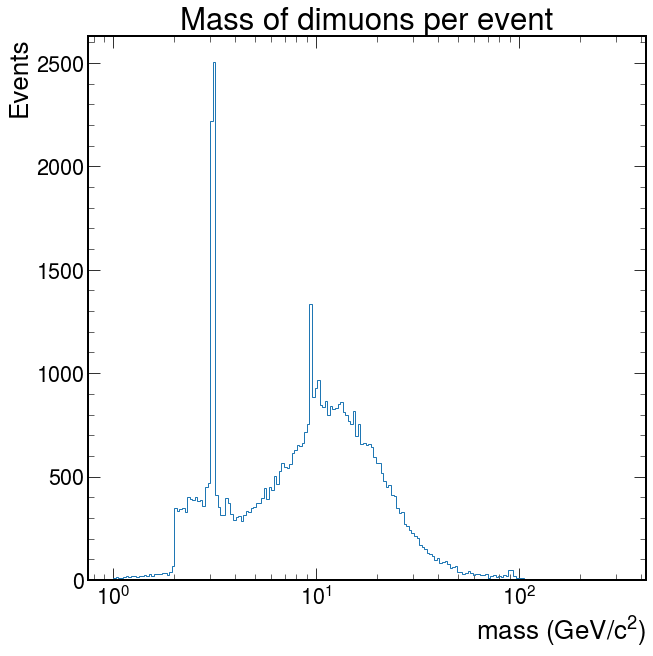

# Introduction

## Looking at the dimuon spectrum over a wide energy range

<!-- Mathjax Support -->
<script type="text/javascript" async
  src="https://cdn.mathjax.org/mathjax/latest/MathJax.js?config=TeX-MML-AM_CHTML">
</script>

<h3>Learning goals</h3>

  - Relativistic kinematics.
  - Mesons.

**Background**

To determine the mass ($$m$$) of a particle you need to know the 4-momenta of the particles ($$\mathbf{P}$$) that are detected after the collision: the energy ($$E$$), the momentum in the x direction

($$p_x$$), the momentum in the y direction ($$p_y$$) and the momentum in the z direction ($$p_z$$).

$$\mathbf{P} = (E,p_x,p_y,p_z)$$

$$
 m = \sqrt{E^2-(p_x^2+p_y^2 + p_z^2)}
$$

Some particles are very unstable and decay (turn into) to two or more other particles. In fact, they can decay so quickly, that they never interact with your detector! Yikes!

However, we can reconstruct the parent particle (sometimes referred to as <b>the initial state particle</b>) and its 4-momentum by adding the 4-momenta of the child particles (sometimes referred to as <b>the decay products</b>).

$$\mathbf{P_{\rm parent}} = \mathbf{P_{\rm child 0}} + \mathbf{P_{\rm child 1}} + \mathbf{P_{\rm child 2}} + ...$$

which breaks down into...

$$E_{\rm parent} = E_{\rm child 0} + E_{\rm child 1} + E_{\rm child 2} + ...$$

$$p_{\rm x parent} = p_{\rm x child 0} + p_{\rm x child 1} + p_{\rm x child 2} + ...$$

$$p_{\rm y parent} = p_{\rm y child 0} + p_{\rm y child 1} + p_{\rm y child 2} + ...$$

$$p_{\rm z parent} = p_{\rm z child 0} + p_{\rm y child 1} + p_{\rm z child 2} + ...$$

<b>Let's code!</b>

Here is some very, very basic starter code. It reads in data from the CMS experiment.

```python
import numpy as np
import h5py
import awkward as ak
import matplotlib.pyplot as plt
import mplhep as hep

plt.style.use("default")
```

Or you can use mplhep styling

```python
hep.style.use("ROOT")

# Load the data

event=h5py.File('data/dimuon100k.hdf5',mode='r')

# and extract it

e=event['muons/e'][:]
px =event['muons/px'][:]
py =event['muons/py'][:]
pz =event['muons/pz'][:]

print(len(px))
# see if there are any anomalies and clean them out
cut=(e**2 - (px**2 + py**2 + pz**2)) <0

print(sum(cut)) #count how many anomalies
```

    200000
    343
{: .output}

We can use numpy to clean our arrays from anomalous events

```python
e=np.delete(e,cut)
px,py,pz=np.delete(px,cut),np.delete(py,cut),np.delete(pz,cut)

# let's calculate the mass
M=(e**2 - (px**2 + py**2 + pz**2))**.5
```

<h2><font color="red">Challenge!</font></h2>

Use the sample code to find the mass of the particle that the two muons came from (parent particle).

To do this, you will need to loop over all pairs of muons for each collision, sum their 4-momenta (energy, px, py, and pz) and then use that to calculate the invariant mass.

Do this for all pairs of muons for the case where the muons have opposite charges.

<i>Hint!</i>

It is very likely that a particle exists where there is a peak in the data. However, this is not always true.
A peak in the data is most likely the mass of a particle. You can look at the approximate mass to figure out which particle
is found in the data.

---

<!--
<h2><font color="red">Challenge!</font></h2>

Use the sample code to find the mass of the particle that the two muons came from (parent particle).

To do this, you will need to loop over all pairs of muons for each collision, sum their 4-momenta (energy, px, py, and pz) and then use that to calculate the invariant mass.

Do this for all possible pairs and in addition, break it down so that you calculate the invariant mass for the cases where:
* Both muons are positively charged.
* Both muons are negatively charged.
* The muons have opposite charges.

Be careful. Some collisions may have more than 2 muons, so write your code such that it calculates all possible pairs of muons in a given collisions. For example, if there are 3 muons in a collision, there are 3 possible pairs that you can make.

<i>Hint!</i>

It is very likely that a particle exists where there is a peak in the data. However, this is not always true.
A peak in the data is most likely the mass of a particle. You can look at the approximate mass to figure out which particle
is found in the data. -->

Your histogram should look something like the following sketch. The value of the peaks should be the mass of a particle. You should be able to find two particles in their ground state. <a href="http://en.wikipedia.org/wiki/J/psi_meson">Check your answer for the first particle!</a> <a href="http://en.wikipedia.org/wiki/Upsilon_meson">Check your answer for the second particle!</a>

```python
from IPython.display import Image
Image(url='https://raw.githubusercontent.com/particle-physics-playground/playground/master/activities/images/dimuons_sketch.jpeg')
```


```python
plt.hist(M,bins=100,
         histtype='step',
        )

plt.xlabel('$\mu_{mass}$ [GeV]')
plt.title('Muon Mass spectrum')
plt.show()
```

{: width="560px"}

Doesn't really look like much. How about we fix that!

## Exercise:

Using the code above, zoom in and fix the above plot to help **visually** estimate the mass of the muon.

*Hint* Google search for the arguments of the `plt.hist` function

> ## Solution
>```python
>plt.hist(M,bins=100,log=False,
>         histtype='step',range=(0.1,0.11)
>        )
>plt.show()
>```
>
>{: width="560px" .image-with-shadow }
{: .solution}

# Let's make the dimuon spectrum

We need to calculate the sum the energies at the event level

**REMEMBER**

$$E_{\rm parent} = E_{\rm child 0} + E_{\rm child 1} + E_{\rm child 2} + ...$$

$$p_{\rm x parent} = p_{\rm x child 0} + p_{\rm x child 1} + p_{\rm x child 2} + ...$$

$$p_{\rm y parent} = p_{\rm y child 0} + p_{\rm y child 1} + p_{\rm y child 2} + ...$$

$$p_{\rm z parent} = p_{\rm z child 0} + p_{\rm y child 1} + p_{\rm z child 2} + ...$$

Let's assume that each event only has 2 muons.
We will use the awkward arrays function `unflatten` because we can make pairs of muons this way.

```python
e=ak.unflatten(e,2)
px=ak.unflatten(px,2)
py=ak.unflatten(py,2)
pz=ak.unflatten(pz,2)

```

Now lets sum the 4-momenta components and calculate the event mass

```python
# we use axis = 1 because it squishes the row dimension and gives us 1 value per row (i.e. 1 value per event)
e = np.sum(e,axis=1)
px = np.sum(px,axis=1)
py = np.sum(py,axis=1)
pz = np.sum(pz,axis=1)
```

# Exercise: Now calculate the mass per event and make the plot.

> ## Solution
>```python
>Mass=np.sqrt((e**2-(px**2+py**2+pz**2)))
>
>
>plt.hist(Mass,bins=2000,
>         histtype='step')
>
>plt.xlabel('mass (GeV/$c^2$)')
>plt.ylabel('Events')
>plt.yscale('symlog')
>plt.xscale('log')
>plt.title('Mass of dimuons per event')
>plt.autoscale()
>
>plt.show()
>```
{: .solution}

{: width="560px"}

Depending on what you did, you may see hints of particles below $$20 GeV/c^2$$. It is possible you see signs of other particles at even higher energies. Plot your masses over a wide range of values, but then zoom in (change the plotting range) on different mass ranges to see if you can identify these particles.  

```python
Image(url='https://twiki.cern.ch/twiki/pub/CMSPublic/HLTDiMuon2017and2018/CMS_HLT_DimuonMass_Inclusive_2017.png')
```



